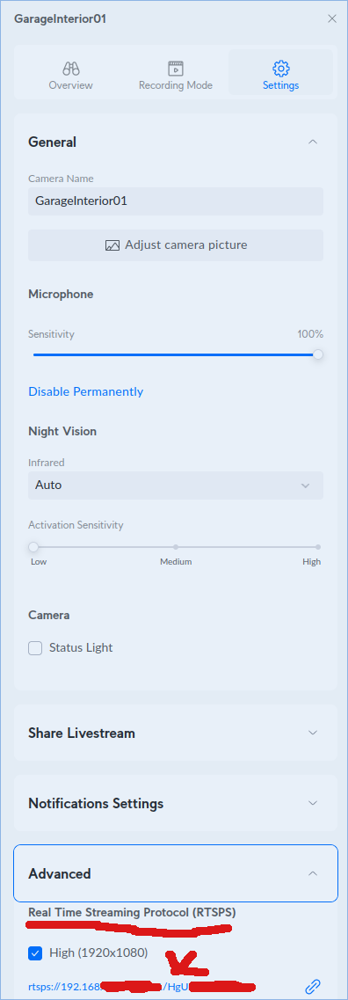
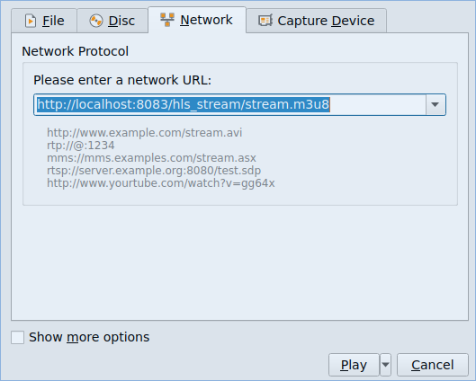

[](https://github.com/TensorTemplar/hls_streamer/actions/workflows/main-ci.yaml) 

Cyclomatic complexity:


## Synopsis

A simple RTSP to HLS stream converter using a gstreamer subprocess with some scaffolding to make it easy to scale by running a container per source RTSP(s) stream.

It will publish publishing `http://<hostname>:<port>/hls_stream/stream.m3u8` by default and optionally register itself in etcd under `/services/hls_streamer_{last 3 characters of source stream ip}` - to enable this pass `ENABLE_DISCOVERY="True"` as an environment variable.


## Requirements

Docker installed on your machine, `--net=host` may not work on all platforms.

## How to run tests

Will require docker to be avialable on the host machine and accessible from python

1. Build the container:
```
docker build -t droidcraft-hls-streamer:dev -f Dockerfile .
docker build -t droidcraft-hls-streamer:test -f Dockerfile.test .
```

3. Run tests from the host (will start a temporary etcd container on localhost:2379)
```
docker run --net=host -t droidcraft-hls-streamer:test pytest -vv
```

Tests are generated by quantized codellama2, good luck with this in production!


## How to run the main thing

1. Build the container:
```
docker build -t droidcraft-hls-streamer:dev .
```

2. Find a RTSP(s) stream and token for a camera. For example a unifi cam:


3. Start the container:
```
docker run -e RTSP_URL="rtsps://<your_ip>:7441" -e RTSP_ACCESS_TOKEN="<your_token>" -e PORT=<optional port if you hate 8000> --net=host droidcraft-hls-streamer:dev
```

Optionally, if you are running ETCD and want to register the streamer under /services/... or want Prometheus export on PROM_PORT (default 8000):
```
-e FEATURE_ENABLE_DISCOVERY=True
-e FEATURE_ENABLE_PROMETHEUS=True -e PROM_PORT=8000
```

check that your stream works, either via the hls supporting browser or vlc.


